

# 🏥 SIHOSystem v4.2.0 - Sistema Integral Hospitalario

## 🌐 **Sistema en Producción**
**🔗 URL del Sistema:** [https://hospital.twinslaboratories.com]([https://tudominio.com](https://hospital.twinslaboratories.com)) 
**🛠️ Hosting:** Banahosting  
**✅ Estado:** En producción - Estable y funcional  
**🚀 Demo en vivo:** [https://hospital.twinslaboratories.com]([https://tudominio.com](https://hospital.twinslaboratories.com)) 

## 👥 **Credenciales de Demo**
- **👑 Administrador:** `admin@siho.com` / `Contacteme si quieres probarlo`
- **👨‍⚕️ Médico:** `medico@siho.com` / `Contacteme si quieres probarlo`
- **👩‍⚕️ Enfermero:** `enfermero@siho.com` / `Contacteme si quieres probarlo`
- **📋 Recepción:** `recepcion@siho.com` / `Contacteme si quieres probarlo`
- **🔬 Laboratorio:** `laboratorio@siho.com` / `Contacteme si quieres probarlo`

## 🚀 **Características Principales**

### 👥 **Sistema Multi-Rol (5 Roles Específicos)**
- **Administrador:** Control total del sistema, gestión de usuarios, reportes
- **Médico:** Gestión de pacientes, consultas, diagnósticos, recetas médicas
- **Enfermero:** Atención primaria, seguimiento de pacientes, signos vitales
- **Recepción:** Registro de pacientes, agendamiento de citas, facturación
- **Laboratorio:** Gestión de exámenes, resultados de análisis, reportes médicos

### 📋 **9 Módulos Completos Implementados**
1. **Gestión de Usuarios** - Sistema completo de autenticación y perfiles
2. **Pacientes** - Historial médico digital, expedientes completos
3. **Encargados** - Responsables legales y contacto de emergencia
4. **Visitas** - Control de visitantes, horarios y registros
5. **Empleados** - Staff médico y administrativo del hospital
6. **Consultas** - Agenda médica, historial de consultas, diagnósticos
7. **Exámenes** - Resultados de laboratorio, imágenes médicas
8. **Recetas** - Prescripciones médicas, tratamientos, medicamentos
9. **Administración** - Configuración del sistema y permisos

## 📸 **Galería Completa del Sistema**

### 🔐 **1. Sistema de Login**
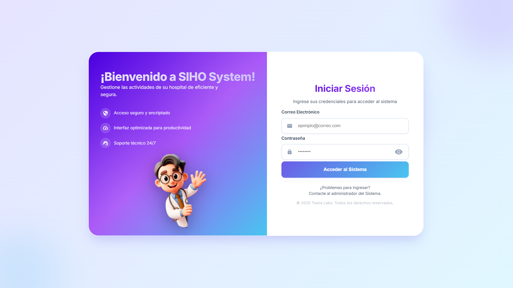
*Interfaz de autenticación segura con selección de rol y acceso personalizado según permisos.*

### 👑 **2. Panel de Administración**
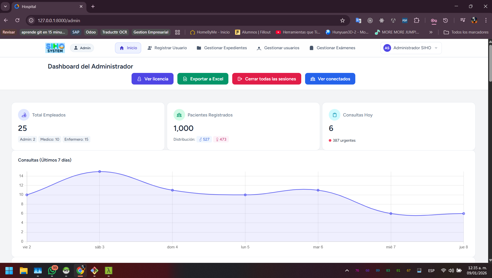
*Dashboard administrativo con métricas en tiempo real, gráficos estadísticos y acceso rápido a todos los módulos.*

### 📁 **3. Gestión de Expedientes**
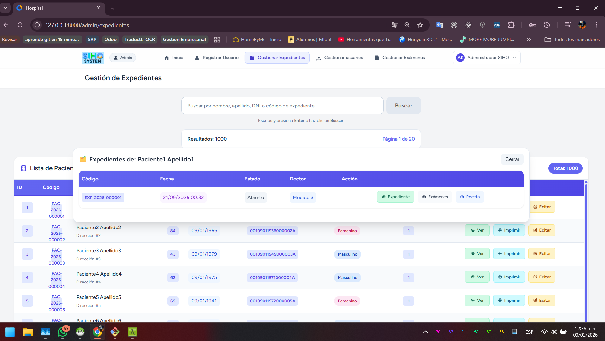
*Sistema completo de gestión de expedientes médicos con búsqueda avanzada y filtros por especialidad.*

### 👤 **4. Edición de Usuarios**
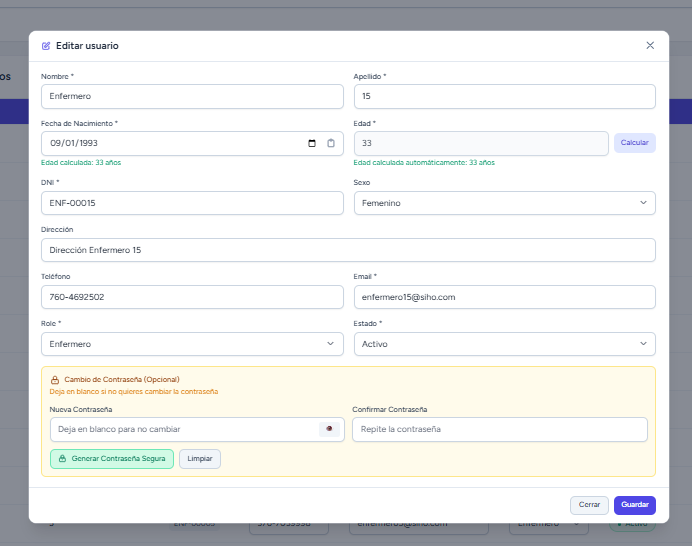
*Interfaz para edición de usuarios, asignación de roles y configuración de permisos individuales.*

### 📋 **5. Dashboard de Recepción**

*Panel de control para recepción con registro rápido de pacientes y gestión de citas pendientes.*

### 🆕 **6. Registro de Pacientes**
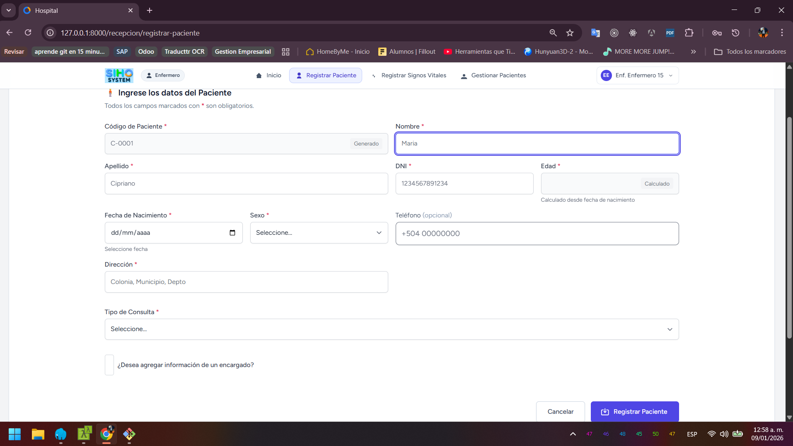
*Formulario completo para registro de nuevos pacientes con validación en tiempo real.*

### 👥 **7. Lista de Pacientes**
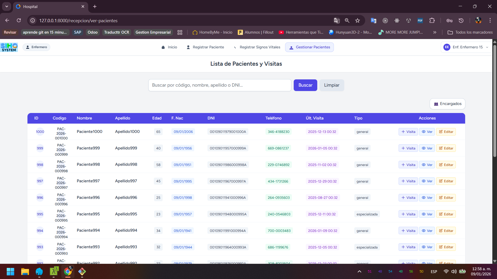
*Vista completa de pacientes registrados con opciones de filtrado, búsqueda y acciones rápidas.*

### 📊 **8. Historial de Visitas**
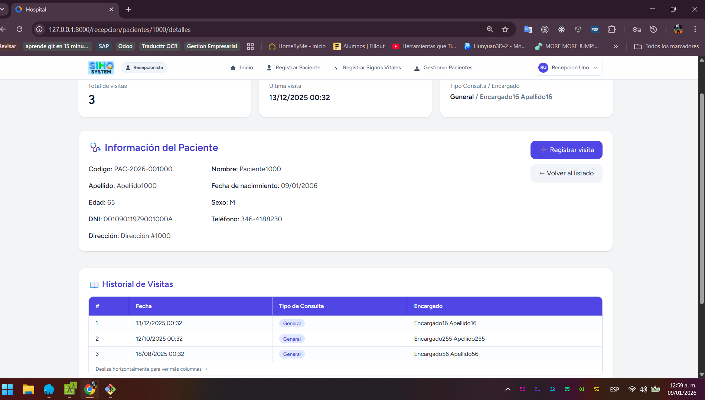
*Registro detallado de todas las visitas médicas con información de consultas, diagnósticos y tratamientos.*

### 👨‍⚕️ **9. Dashboard Médico**
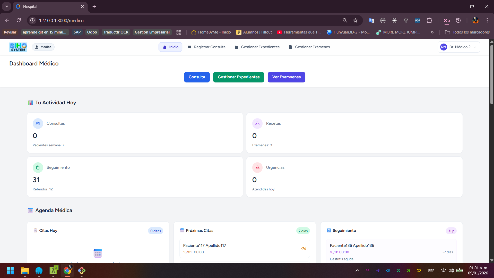
*Panel personalizado para médicos con agenda del día, pacientes pendientes y accesos rápidos.*

### 🩺 **10. Registrar Consulta Médica**
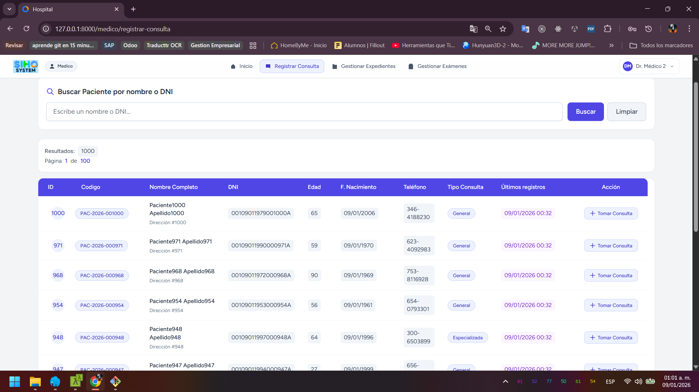
*Formulario completo para registro de consultas médicas con diagnóstico, tratamiento y seguimiento.*

### 📄 **11. Gestión de Expedientes Médicos**
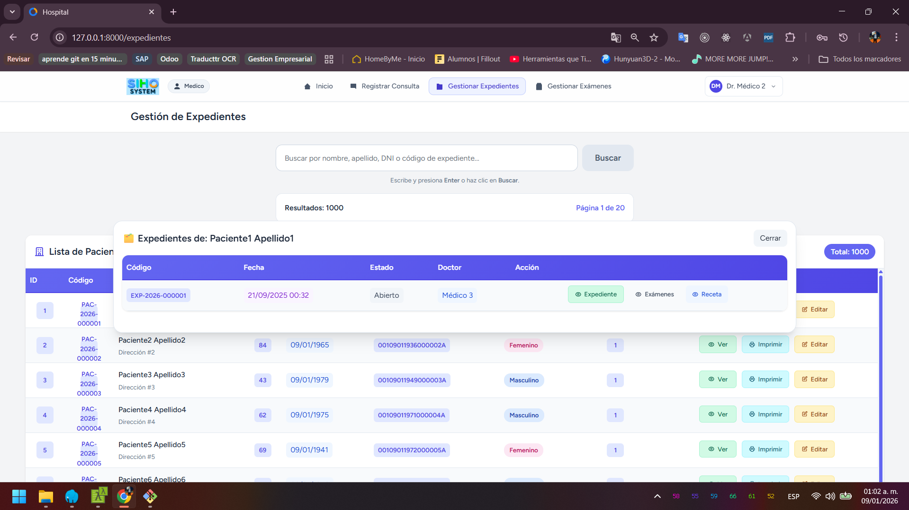
*Sistema organizado para gestión de expedientes médicos con historial completo y documentos adjuntos.*

### 🔬 **12. Gestión de Exámenes**
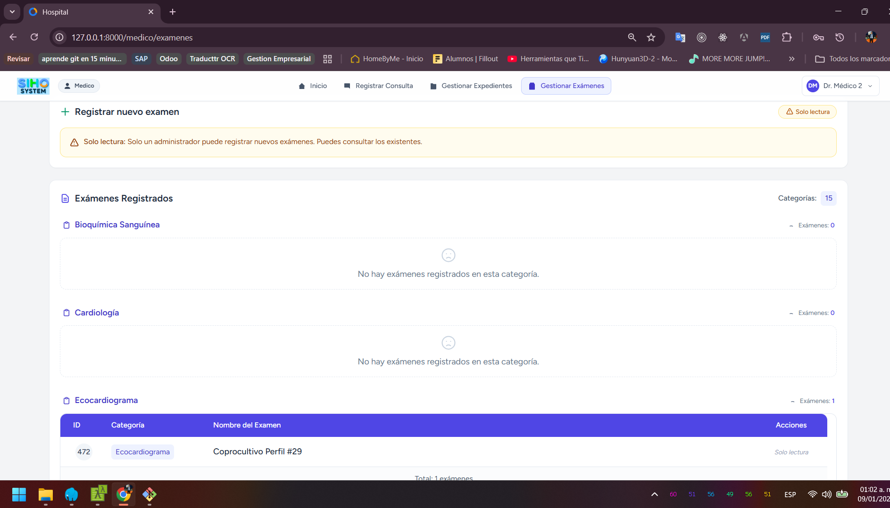
*Interfaz para gestión de exámenes médicos, resultados de laboratorio y análisis clínicos.*

### 📱 **13. Responsividad - Mobile View 1**
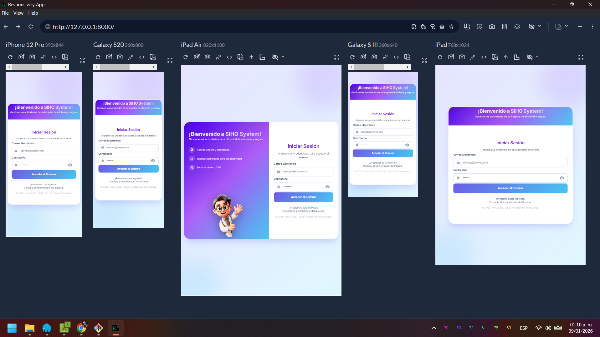
*Vista móvil optimizada del dashboard con menú colapsable y diseño adaptativo.*

### 📱 **14. Responsividad - Mobile View 2**
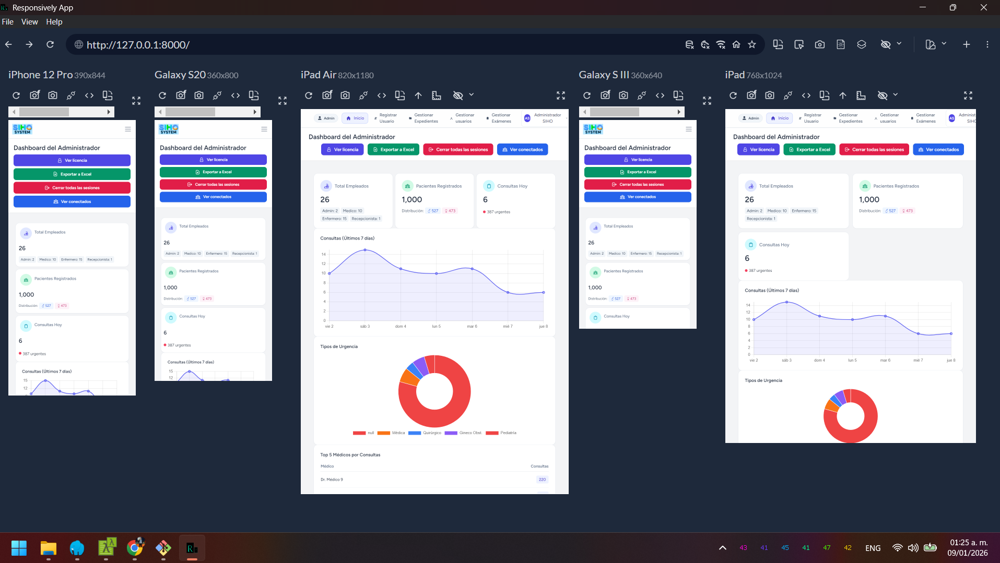
*Interfaz móvil de gestión de pacientes con formularios adaptados a pantallas pequeñas.*

### 📱 **15. Responsividad - Mobile View 3**
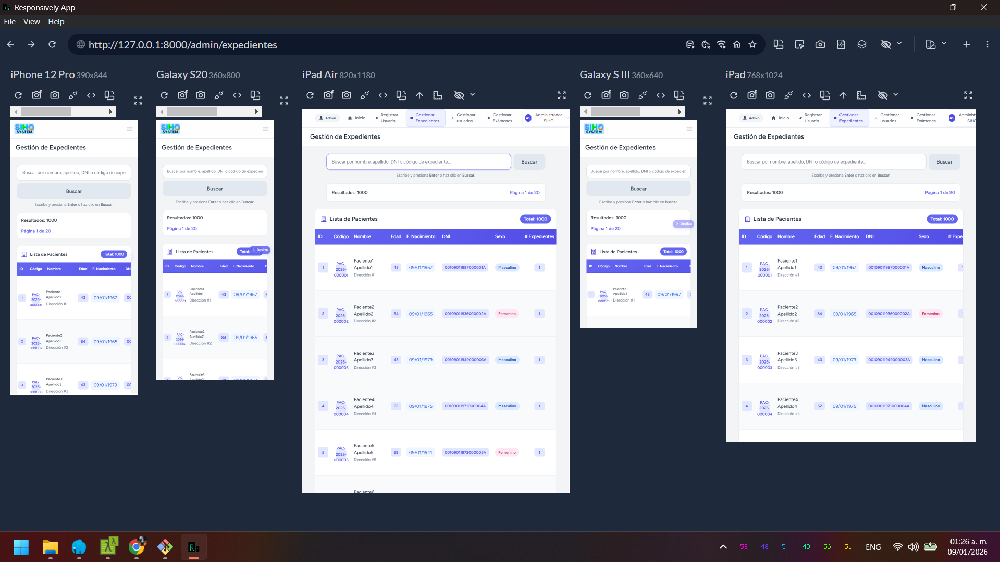
*Vista mobile del sistema de citas con calendario adaptativo y navegación táctil.*

### 📱 **16. Responsividad - Mobile View 4**
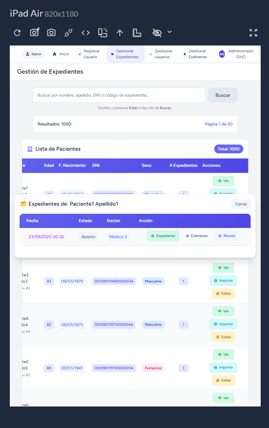
*Panel administrativo en versión móvil con gráficos responsivos y menú optimizado.*

### 📱 **17. Responsividad - Mobile View 5**
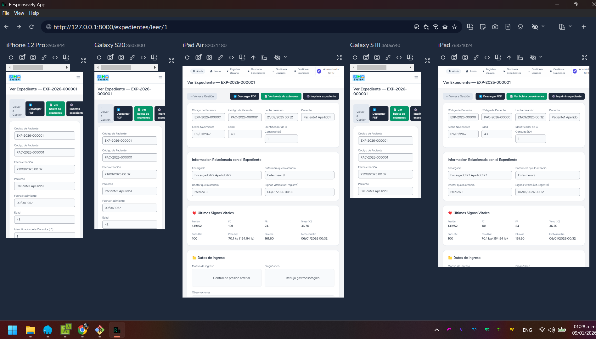
*Formularios médicos completamente adaptados para dispositivos móviles y tablets.*

## 🛠️ **Stack Tecnológico**

| Tecnología | Versión | Uso en el Proyecto |
|------------|---------|-------------------|
| **Laravel** | 12.x | Backend MVC, autenticación, API |
| **PHP** | 8.2+ | Lenguaje principal del backend |
| **MySQL** | 8.0 | Base de datos relacional principal |
| **Tailwind CSS** | 3.4 | Framework CSS para diseño responsive |
| **Laravel Breeze** | Latest | Sistema de autenticación y scaffolding |
| **Eloquent ORM** | - | Mapeo objeto-relacional para MySQL |
| **JavaScript** | ES6+ | Interactividad del frontend |
| **Banahosting** | - | Hosting en producción con SSL |

## 🎯 **Características Técnicas Destacadas**

### ✅ **Arquitectura y Performance**
- Arquitectura MVC 
- Optimización de consultas a base de datos
- Middleware personalizado para cada rol

### ✅ **Seguridad y Validaciones**
- Autenticación con Laravel Breeze
- 5 niveles de roles con middleware específico
- Validaciones en servidor y cliente
- Protección CSRF y sanitización de datos
- Passwords encriptados con bcrypt

### ✅ **Experiencia de Usuario**
- Diseño 100% responsive con Tailwind CSS
- Interfaz intuitiva y user-friendly
- Navegación optimizada para cada rol
- Carga rápida de páginas y componentes
- Compatibilidad total con móviles y tablets

### ✅ **Funcionalidades Avanzadas**
- Sistema de búsqueda con filtros múltiples
- Exportación de datos a PDF y Excel
- Reportes estadísticos con gráficos
- Historial completo de actividades

